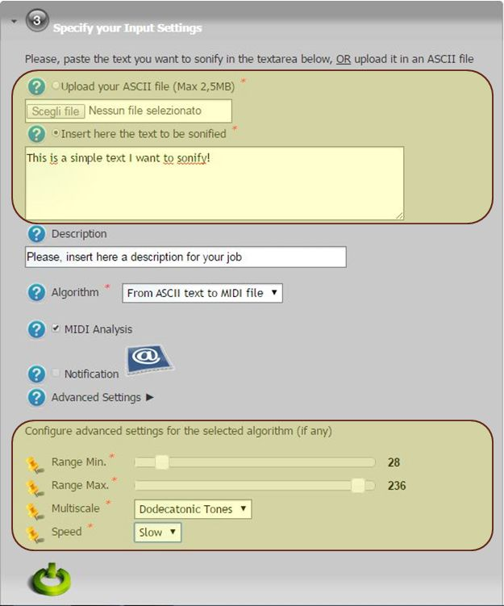

*********************
SONIFICATION v1.3.9 Docs
*********************

============
About
============

Data Sonification is the representation of data by means of sound signals, so it is the analog of scientific visualization, where we deal with auditory instead of visual images. Generally speaking any sonification procedure is a mathematical mapping from a certain data set (numbers, strings, images, ...) to a sound string.

Data sonification is currently used in several fields, for different purposes: science and engineering, education and training, since it provides a quick and effective data analysis and interpretation tool. Although most data analysis techniques are exclusively visual in nature (i.e. are based on the possibility of looking at graphical representations), data presentation and exploration systems could benefit greatly from the addition of sonification capacities.

============
Installation
============
To install this portlet the WAR file has to be deployed into the application server.

As soon as the portlet has been successfully deployed on the Science Gateway the administrator has to configure:

- the list of e-Infrastructures where the application can be executed;

- some additional application settings.

1.) To configure a generic e-Infrastructure, the following settings have to be provided:

**Enabled**: A true/false flag which enables or disable the generic e-Infrastructure;

**Infrastructure**: The acronym to reference the e-Infrastructure;

**VOName**: The VO for this e-Infrastructure;

**TopBDII**: The Top BDII for this e-Infrastructure;

**WMS Endpoint**: A list of WMS endpoint for this e-Infrastructure (max. 10);

**MyProxyServer**: The MyProxyServer for this e-Infrastructure;

**eTokenServer**: The eTokenServer for this e-Infrastructure;

**Port**: The eTokenServer port for this e-Infrastructure;

**Serial Number**: The MD5SUM of the robot certificate to be used for this e-Infrastructure;

In the following figure is shown how the portlet has been configured to run simulation on the EUMEDGRID-Support e-Infrastructure.

2.) To configure the application, the following settings have to be provided:

**AppID**: The ApplicationID as registered in the UserTracking MySQL database (GridOperations table);

**Software TAG**: The list of software tags requested by the application;

**SMTP Host**: The SMTP server used to send notification to users;

**Sender**: The FROM e-mail address to send notification messages about the jobs execution to users;

.. _CHAIN-REDS: https://science-gateway.chain-project.eu/

In the figure below is shown how the application settings have been configured to run on the CHAIN-REDS_ Science Gateway.

============
Usage
============

To run the  simulation the user has to:

- click on the *third* accordion of the portlet and,

- select the input file (e.g. *.ski* or *.mid* files) OR select a demo from the list as shown in the below figure:

Each simulation will produce:

.. _POVRay: http://www.povray.org/
.. _Matlab: http://it.mathworks.com/

- *std.txt*: the standard output file;

- *std.err*: the standard error file;

- *.wav*: the final MIDI file produced during the sonification process;

- *.png*: a list of 3D rendering images produced with POVRay_ if enabled.

.. image:: https://www.jyu.fi/hum/laitokset/musiikki/en/research/coe/materials/miditoolbox/logo_med
   :align: center
   :target: https://www.jyu.fi/hum/laitokset/musiikki/en/research/coe/materials/miditoolbox/

If MIDI Analysis is enabled, a compilation of functions to analyze and visualize MIDI files in the Matlab_ computing environment will be used.

A typical simulation produces, at the end, the following files:

.. code:: bash

        ]$ tree DataSonificationSimulationStarted_148682
        DataSonificationSimulationStarted_148682/
        ├── messages.mid
        ├── output.README
        ├── Text2Midi.err
        └── Text2Midi.out

============
References
============

.. _1: http://www.sciencedirect.com/science/article/pii/S187705091000044X

* Proceedings of the International Conference on Computational Science, ICCS2010, doi:10.1016/j.procs.2010.04.043: *"Data sonification of volcano sesmograms and Sound/Timbre recountruction of ancient musical instruments with Grid infrastructures"* – May, 2010 Amsterdam, The Netherlands [1_];

============
Support
============
Please feel free to contact us any time if you have any questions or comments.

.. _INFN: http://www.ct.infn.it/
.. _DANTE: http://www.dante.net/
.. _4: http://www.conservatoriocimarosa.org/

:Authors:

 `Roberto BARBERA <mailto:roberto.barbera@ct.infn.it>`_ - Italian National Institute of Nuclear Physics (INFN_),
 
 `Giuseppe LA ROCCA <mailto:giuseppe.larocca@ct.infn.it>`_ - Italian National Institute of Nuclear Physics (INFN_),
 
 `Mariapaola SORRENTINO <mailto:mariapaola.sorrentino@gmail.com>`_ - Conservatory of Music of Avellino ([4_]),
 
 `Domenico VICINANZA <mailto:domenico.vicinanza@dante.net>`_ - DANTE (DANTE_),

:Version: v1.3.9, 2015

:Date: June 1st, 2015 08:50
